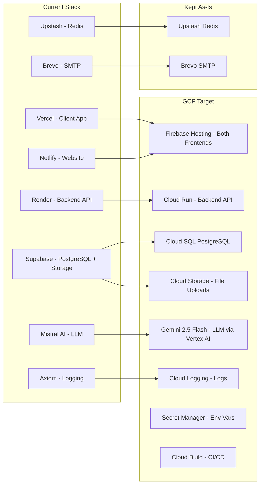
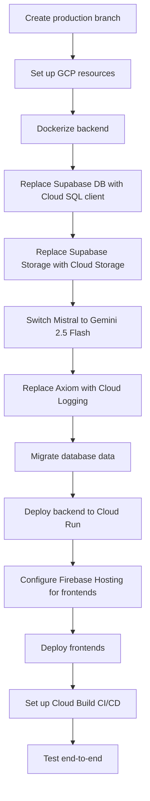

# GCP Migration Plan -- Nexora

> Migrate the entire Nexora stack (2 React frontends + Express backend) to GCP using the cheapest services available, switching LLM from Mistral to Gemini 2.5 Flash, keeping Upstash Redis as-is. Target well under $300/month.

---

## Current Stack vs GCP Target



---

## Cost-Optimized GCP Service Selection

| Current Service | GCP Replacement | Est. Monthly Cost |
|---|---|---|
| Vercel (client app) | **Firebase Hosting** (free tier) | ~$0 |
| Netlify (website) | **Firebase Hosting** (free tier) | ~$0 |
| Render (backend) | **Cloud Run** (free tier: 2M requests/mo) | ~$0-5 |
| Supabase PostgreSQL | **Cloud SQL PostgreSQL** (db-f1-micro, shared) | ~$7-10 |
| Supabase Storage | **Cloud Storage** (Standard bucket) | ~$0-2 |
| Upstash Redis | **Keep Upstash** (works anywhere, free tier) | $0 |
| Axiom (logging) | **Cloud Logging** (free 50GB/mo) | ~$0 |
| Brevo SMTP | **Keep Brevo** (no GCP SMTP equivalent) | $0 (free tier) |
| Mistral AI | **Gemini 2.5 Flash** via Vertex AI | ~$0-3 (very cheap) |
| LangSmith | **Keep LangSmith** (no change needed) | existing cost |
| Tavily | **Keep Tavily** (no change needed) | existing cost |
| GitHub Actions CI | **Cloud Build** (free 120 min/day) | ~$0 |

**Estimated total: ~$10-20/month** (extremely cost-efficient, $300 credits last 15+ months)

---

## What You Need to Set Up on GCP Console

Before any code changes, create these resources on your GCP project:

1. **GCP Project** -- Create a new project (e.g., `nexora`)
2. **Enable APIs**:
   - Cloud Run API
   - Cloud SQL Admin API
   - Cloud Build API
   - Cloud Storage API
   - Secret Manager API
   - Artifact Registry API
   - Vertex AI API (for Gemini 2.5 Flash)
   - Firebase Hosting (via Firebase Console)
3. **Cloud SQL Instance**:
   - Engine: PostgreSQL 15
   - Machine type: `db-f1-micro` (shared, cheapest)
   - Region: `us-central1` (cheapest)
   - Storage: 10GB SSD
   - Enable `pgvector` and `pgcrypto` extensions
4. **Cloud Storage Bucket**: `nexora-files` (Standard, `us-central1`)
5. **Artifact Registry**: Docker repo for container images
6. **Secret Manager**: Store all env vars as secrets
7. **Service Account**: For Cloud Run with roles:
   - `roles/cloudsql.client`
   - `roles/storage.objectAdmin`
   - `roles/secretmanager.secretAccessor`
   - `roles/aiplatform.user` (for Vertex AI / Gemini)

---

## Code Changes Required

### 1. Backend (`biz-flow/`) -- Dockerize + Adapt for GCP

- **Add `Dockerfile`** for the Express backend
- **Add `cloudbuild.yaml`** for CI/CD pipeline
- **Replace Supabase DB client** with direct `pg` (node-postgres) connecting to Cloud SQL via Unix socket
- **Replace Supabase Storage** with `@google-cloud/storage` for file uploads
- **Keep Upstash Redis** -- no changes needed, works from anywhere
- **Replace Mistral AI with Gemini 2.5 Flash** -- swap `@langchain/mistralai` with `@langchain/google-genai` (ChatGoogleGenerativeAI + GoogleGenerativeAIEmbeddings)
- **Replace Axiom logging** with `console.log` (Cloud Run auto-captures stdout to Cloud Logging)
- **Update env vars** to pull from Secret Manager or Cloud Run env config

Key files to modify:

- `biz-flow/src/config/supabase.ts` -- replace with Cloud SQL pg pool + Cloud Storage clients
- `biz-flow/src/config/axiom.ts` -- replace with Cloud Logging / stdout
- `biz-flow/src/routes/files.ts` -- update file upload/download to use Cloud Storage
- `biz-flow/src/server.ts` -- update startup for Cloud Run (port from `PORT` env)
- `biz-flow/src/agents/*.ts` -- switch all LLM calls from Mistral to Gemini 2.5 Flash
- All route files referencing `supabase` -- switch to `pg` pool queries
- `biz-flow/src/config/redis.ts` -- **no changes** (keep Upstash)

### 2. Database Migration

- Export all Supabase tables/data using `pg_dump`
- Import into Cloud SQL instance
- Run existing migration: `biz-flow/supabase/migrations/20260309_tool_registry_scaling.sql`
- Enable `vector` and `pgcrypto` extensions on Cloud SQL

### 3. Frontends (`client/` and `website/`) -- Firebase Hosting

- Add `firebase.json` config at project root
- Add `.firebaserc` for project alias
- Build both React apps and deploy as static sites
- Update `VITE_API_URL` to point to Cloud Run backend URL

### 4. CI/CD -- Cloud Build

- Replace GitHub Actions (`biz-flow/.github/workflows/tools-sync.yml`) with `cloudbuild.yaml`
- Auto-build and deploy to Cloud Run on push to `production` branch
- Auto-deploy frontends to Firebase Hosting

### 5. LLM Migration: Mistral -> Gemini 2.5 Flash

This is a key change. All LangChain agent files currently use:

- `ChatMistralAI` -> replace with `ChatGoogleGenerativeAI` (model: `gemini-2.5-flash`)
- `MistralAIEmbeddings` -> replace with `GoogleGenerativeAIEmbeddings` (model: `text-embedding-004`)
- Remove `@langchain/mistralai` dependency, add `@langchain/google-genai`
- Env vars: remove `MISTRAL_API_KEY/BASE/MODEL`, add `GOOGLE_API_KEY` (or use Vertex AI ADC on Cloud Run)

### 6. New Files to Create

```
/
├── biz-flow/
│   ├── Dockerfile                # Backend container
│   ├── .dockerignore
│   ├── src/config/
│   │   ├── database.ts           # Cloud SQL pg pool (replaces supabase.ts)
│   │   ├── storage.ts            # Cloud Storage client
│   │   └── logger.ts             # Cloud Logging (replaces axiom.ts)
│   └── ...
├── firebase.json                 # Frontend hosting config
├── .firebaserc                   # Firebase project config
├── cloudbuild.yaml               # CI/CD pipeline
├── infra/
    └── setup.sh                  # gcloud CLI script to provision all resources
```

---

## Migration Order (Safe Rollout)



---

## Task Checklist

- [ ] Create `production` branch from main
- [ ] Add Dockerfile and .dockerignore for biz-flow backend
- [ ] Replace Supabase DB client with node-postgres Cloud SQL client
- [ ] Replace Supabase Storage with @google-cloud/storage
- [ ] Keep Upstash Redis as-is (no changes needed)
- [ ] Replace Mistral AI with Gemini 2.5 Flash via @langchain/google-genai
- [ ] Replace Axiom with Cloud Logging / stdout logging
- [ ] Update all route files to use new pg pool instead of supabase client
- [ ] Add firebase.json and .firebaserc for frontend deployments
- [ ] Add cloudbuild.yaml for CI/CD pipeline
- [ ] Create infra/setup.sh with gcloud CLI commands
- [ ] Update .env.example with new GCP-specific environment variables
- [ ] Update appChatAgent.ts and other agent files that reference supabase

---

## Services That Stay As-Is (No Change Needed)

- **Upstash Redis** -- Serverless Redis, works from anywhere, free tier
- **Brevo SMTP** -- Email delivery, no GCP equivalent
- **LangSmith** -- LangChain tracing, works from anywhere
- **Tavily** -- Web search API, works from anywhere
